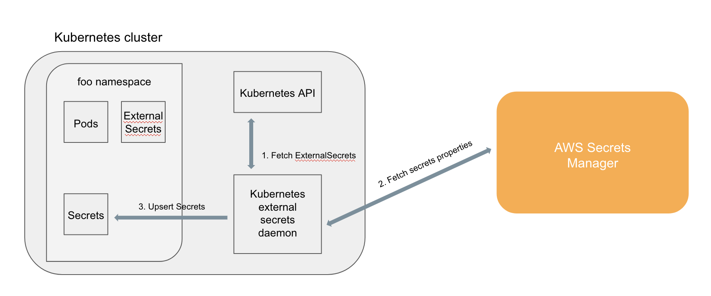

[](https://godaddy-oss-slack.herokuapp.com/) [](https://greenkeeper.io/)
[](http://standardjs.com)

# 💂 Kubernetes External Secrets

Kubernetes External Secrets allows you to use external secret management systems (*e.g.*, [AWS Secrets Manager](https://aws.amazon.com/secrets-manager/)) to securely add secrets in Kubernetes. Read more about the design and motivation for Kubernetes External Secrets on the [GoDaddy Engineering Blog](https://godaddy.github.io/2019/04/16/kubernetes-external-secrets/).

## How it works

The project extends the Kubernetes API by adding a `ExternalSecrets` object using [Custom Resource Definition](https://kubernetes.io/docs/concepts/extend-kubernetes/api-extension/custom-resources/) and a controller to implement the behavior of the object itself.

An `ExternalSecret` declares how to fetch the secret data, while the controller converts all `ExternalSecrets` to `Secrets`.
The conversion is completely transparent to `Pods` that can access `Secrets` normally.

## System architecture



1. `ExternalSecrets` are added in the cluster (e.g., `kubectl apply -f external-secret-example.yml`)
1. Controller fetches `ExternalSecrets` using the Kubernetes API
1. Controller uses `ExternalSecrets` to fetch secret data from external providers (e.g, AWS Secrets Manager)
1. Controller upsert `Secrets`
1. `Pods` can access `Secrets` normally

## How to use it

### Install with Helm

Alternatively, the included [charts/kubernetes-external-secrets](charts/kubernetes-external-secrets) can be used to create the `kubernetes-external-secrets` resources and `Deployment` on a [Kubernetes](http://kubernetes.io) cluster using the [Helm](https://helm.sh) package manager.

#### Installing the Chart

```bash
helm install --name kubernetes-external-secrets \
--set env.AWS_REGION='<aws-region>' \
charts/kubernetes-external-secrets
```

> **Tip:** A namespace can be specified by the `Helm` option '`--namespace kube-external-secrets`'

#### Uninstalling the Chart

To uninstall/delete the `kubernetes-external-secrets` deployment:

```bash
helm delete kubernetes-external-secrets
```

#### Configuration

The following table lists the configurable parameters of the `kubernetes-external-secrets` chart and their default values.

| Parameter                                 | Description                                                  | Default                                                 |
| ----------------------------------------- | ------------------------------------------------------------ | ------------------------------------------------------- |
| `env.AWS_REGION`                          | Set AWS_REGION in Deployment Pod                             | `us-west-2`                                             |
| `env.LOG_LEVEL`                           | Set the application log level                                | `info`                                                  |
| `env.METRICS_PORT`                        | Specify the port for the prometheus metrics server           | `3001`                                                  |
| `env.POLLER_INTERVAL_MILLISECONDS`        | Set POLLER_INTERVAL_MILLISECONDS in Deployment Pod           | `10000`                                                 |
| `envVarsFromSecret.AWS_ACCESS_KEY_ID`     | Set AWS_ACCESS_KEY_ID (from a secret) in Deployment Pod      |                                                         |
| `envVarsFromSecret.AWS_SECRET_ACCESS_KEY` | Set AWS_SECRET_ACCESS_KEY (from a secret) in Deployment Pod  |                                                         |
| `image.repository`                        | kubernetes-external-secrets Image name                       | `godaddy/kubernetes-external-secrets`                   |
| `image.tag`                               | kubernetes-external-secrets Image tag                        | `1.2.0`                                                 |
| `image.pullPolicy`                        | Image pull policy                                            | `IfNotPresent`                                          |
| `rbac.create`                             | Create & use RBAC resources                                  | `true`                                                  |
| `serviceAccount.create`                   | Whether a new service account name should be created.        | `true`                                                  |
| `serviceAccount.name`                     | Service account to be used.                                  | automatically generated                                 |
| `podAnnotations`                          | Annotations to be added to pods                              | `{}`                                                    |
| `replicaCount`                            | Number of replicas                                           | `1`                                                     |
| `nodeSelector`                            | node labels for pod assignment                               | `{}`                                                    |
| `tolerations`                             | List of node taints to tolerate (requires Kubernetes >= 1.6) | `[]`                                                    |
| `affinity`                                | Affinity for pod assignment                                  | `{}`                                                    |
| `resources`                               | Pod resource requests & limits                               | `{}`                                                    |

Specify each parameter using the `--set key=value[,key=value]` argument to `helm install`. For example,

```bash
helm install --name kubernetes-external-secrets \
--set env.POLLER_INTERVAL_MILLISECONDS='300000' \
--set podAnnotations."iam\.amazonaws\.com/role"='Name-Of-IAM-Role-With-SecretManager-Access' \
charts/kubernetes-external-secrets
```

### Use IAM credentials for Secrets Manager access

If not running on EKS you will have to use an IAM user (in lieu of a role).
Set AWS_ACCESS_KEY_ID and AWS_SECRET_ACCESS_KEY env vars in the session/pod.
You can use envVarsFromSecret in the helm chart to create these env vars from existing k8s secrets

Additionally, you can specify a `roleArn` which will be assumed before retrieving the secret.
You can limit the range of roles which can be assumed by this particular *namespace* by using annotations on the namespace resource.
The annotation value is evaluated as a regular expression and tries to match the `roleArn`.

```yaml
kind: Namespace
metadata:
  name: iam-example
  annotations:
    iam.amazonaws.com/permitted: "arn:aws:iam::123456789012:role/.*"
```

### Add a secret

Add your secret data to your backend. For example, AWS Secrets Manager:

```
aws secretsmanager create-secret --name hello-service/password --secret-string "1234"
```

AWS Parameter Store:

```
aws ssm put-parameter --name "/hello-service/password" --type "String" --value "1234"
```

and then create a `hello-service-external-secret.yml` file:

```yml
apiVersion: 'kubernetes-client.io/v1'
kind: ExternalSecret
metadata:
  name: hello-service
secretDescriptor:
  backendType: secretsManager
  # optional: specify role to assume when retrieving the data
  roleArn: arn:aws:iam::123456789012:role/test-role
  data:
    - key: hello-service/password
      name: password
```
or
```yml
apiVersion: 'kubernetes-client.io/v1'
kind: ExternalSecret
metadata:
  name: hello-service
secretDescriptor:
  backendType: systemManager
  data:
    - key: /hello-service/password
      name: password
```

The following IAM policy allows a user or role to access parameters matching `prod-*`.
```json
{
  "Version": "2012-10-17",
  "Statement": [
    {
      "Effect": "Allow",
      "Action": "ssm:GetParameter",
      "Resource": "arn:aws:ssm:us-west-2:123456789012:parameter/prod-*"
    }
  ]
}
```

The IAM policy for Secrets Manager is similar ([see docs](https://docs.aws.amazon.com/mediaconnect/latest/ug/iam-policy-examples-asm-secrets.html)):

```json
{
  "Version": "2012-10-17",
  "Statement": [
    {
      "Effect": "Allow",
      "Action": [
        "secretsmanager:GetResourcePolicy",
        "secretsmanager:GetSecretValue",
        "secretsmanager:DescribeSecret",
        "secretsmanager:ListSecretVersionIds"
      ],
      "Resource": [
        "arn:aws:secretsmanager:us-west-2:111122223333:secret:aes128-1a2b3c",
        "arn:aws:secretsmanager:us-west-2:111122223333:secret:aes192-4D5e6F",
        "arn:aws:secretsmanager:us-west-2:111122223333:secret:aes256-7g8H9i"
      ]
    }
  ]
}
```

Save the file and run:

```sh
kubectl apply -f hello-service-external-secret.yml
```

Wait a few minutes and verify that the associated `Secret` has been created:

```sh
kubectl get secret hello-service -o=yaml
```

The `Secret` created by the controller should look like:

```yml
apiVersion: v1
kind: Secret
metadata:
  name: hello-service
type: Opaque
data:
  password: MTIzNA==
```

## Backends

kubernetes-external-secrets supports both AWS Secrets Manager and AWS System Manager.

### AWS Secrets Manager

kubernetes-external-secrets supports both JSON objects ("Secret
key/value" in the AWS console) or strings ("Plaintext" in the AWS
console). Using JSON objects is useful when you need to atomically
update multiple values. For example, when rotating a client
certificate and private key.

When writing an ExternalSecret for a JSON object you _may_ specify the
properties to use. For example, if we add our hello-service
credentials as a single JSON object:

```
aws secretsmanager create-secret --region us-west-2 --name hello-service/credentials --secret-string '{"username":"admin","password":"1234"}'
```

We can declare which properties we want from hello-service/credentials:

```yml
apiVersion: 'kubernetes-client.io/v1'
kind: ExternalSecret
metadata:
  name: hello-service
secretDescriptor:
  backendType: secretsManager
  # optional: specify role to assume when retrieving the data
  roleArn: arn:aws:iam::123456789012:role/test-role
  data:
    - key: hello-service/credentials
      name: password
      property: password
    - key: hello-service/credentials
      name: username
      property: username
```

...or we can omit name and property when we want _all_ properties from hello-service/credentials.

```yml
apiVersion: 'kubernetes-client.io/v1'
kind: ExternalSecret
metadata:
  name: hello-service
secretDescriptor:
  backendType: secretsManager
  # optional: specify role to assume when retrieving the data
  roleArn: arn:aws:iam::123456789012:role/test-role
  data:
    - key: hello-service/credentials
```

## Metrics

kubernetes-external-secrets exposes the following metrics over a prometheus endpoint:

| Metric                                    | Description                                                                     | Example                                                                       |
| ----------------------------------------- | ------------------------------------------------------------------------------- | ----------------------------------------------------------------------------- |
| `sync_calls`                              | This metric counts the number of sync calls by backend, secret name and status  | `sync_calls{name="foo",namespace="example",backend="foo",status="success"} 1` |


## Development

[Minikube](https://kubernetes.io/docs/tasks/tools/install-minikube/) is a tool that makes it easy to run a Kubernetes cluster locally.

Start minikube and the daemon. This creates the `CustomerResourceDefinition`, and starts to process `ExternalSecrets`:

```sh
minikube start

npm run nodemon
```

### Development with localstack

[Localstack](https://github.com/localstack/localstack) mocks AWS services locally so you can test without connecting to AWS.

Run localstack in a seperate terminal window

```sh
npm run localstack
```

Start minikube as above

```sh
minikube start
```

Run the daemon with localstack

```sh
npm run local
```

Add secrets using the AWS cli (example)

```sh
 aws --endpoint-url=http://localhost:4584 secretsmanager create-secret --name hello-service/password --secret-string "1234"
```
